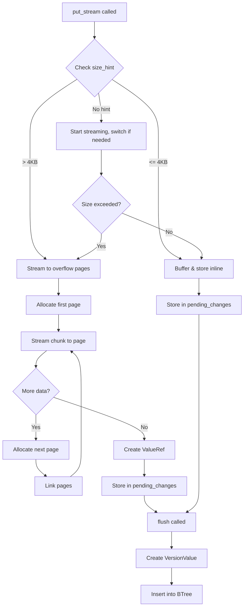
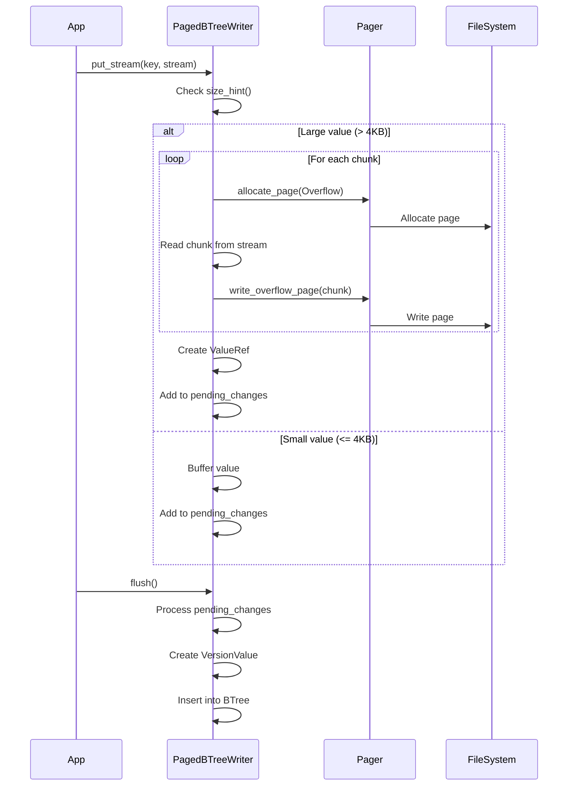

# BTree True Streaming Implementation Design

**Status:** Design Phase  
**Created:** 2026-05-19  
**Author:** AI Assistant  
**Related Issues:** Performance optimization for large value streaming

## Executive Summary

This document provides a detailed design for implementing true streaming support in the BTree table engine. Currently, [`put_stream()`](src/table/btree/paged.rs:1808) buffers entire values in memory before writing to overflow pages, defeating the purpose of streaming for large values. This design leverages existing infrastructure (ValueRef, VersionValue, OverflowChainStream) to enable genuine streaming without memory buffering.

**Key Benefits:**
- Eliminate memory buffering for large values (currently buffers entire value)
- Enable streaming of arbitrarily large values (GB+ sizes)
- Maintain ACID guarantees with proper rollback support
- Leverage existing overflow page infrastructure
- Minimal API changes (internal implementation only)

## 1. Current State Analysis

### 1.1 Existing Infrastructure

The codebase already has all necessary components:

1. **ValueRef** ([`src/types.rs:169`](src/types.rs:169))
   - `Inline`: Small values stored directly
   - `SinglePage`: Medium values in one overflow page
   - `OverflowChain`: Large values across multiple pages

2. **VersionValue** ([`src/txn/version.rs:30`](src/txn/version.rs:30))
   - `Inline(Vec<u8>)`: Buffered values
   - `External(ValueRef)`: Reference to overflow pages

3. **OverflowChainStream** ([`src/pager/overflow_stream.rs:27`](src/pager/overflow_stream.rs:27))
   - Implements `ValueStream` trait
   - Reads from overflow page chains
   - Already handles checksums and validation

4. **Pager Methods** ([`src/pager/pagefile.rs:742`](src/pager/pagefile.rs:742))
   - [`write_overflow_page()`](src/pager/pagefile.rs:743): Write single page
   - [`allocate_overflow_chain()`](src/pager/pagefile.rs:825): Allocate and write chain (buffers data)
   - [`read_overflow_chain()`](src/pager/pagefile.rs:872): Read entire chain

### 1.2 Current Problem

The current [`put_stream()`](src/table/btree/paged.rs:1808) implementation:

```rust
// Lines 1837-1846: Buffers entire value in memory
let mut buffer = Vec::new();
let mut temp_buf = vec![0u8; 8192];
loop {
    let n = stream.read(&mut temp_buf)?;
    if n == 0 {
        break;
    }
    buffer.extend_from_slice(&temp_buf[..n]);
}
```

This defeats streaming for large values (e.g., 1GB video file would require 1GB RAM).

### 1.3 Inline Threshold

Currently configured at 4KB ([`src/table/btree/paged.rs:1891`](src/table/btree/paged.rs:1891)):
```rust
fn max_inline_size(&self) -> Option<usize> {
    Some(4096)
}
```

## 2. Architecture Overview

### 2.1 High-Level Flow



### 2.2 Component Interaction



## 3. Detailed Implementation Plan

### 3.1 New Data Structures

#### 3.1.1 PendingChange Enum

Replace `Vec<(Vec<u8>, Option<Vec<u8>>)>` with structured enum:

```rust
/// Represents a pending change in the writer's buffer
enum PendingChange {
    /// Insert/update with inline value
    PutInline {
        key: Vec<u8>,
        value: Vec<u8>,
    },
    /// Insert/update with external value (already written to overflow pages)
    PutExternal {
        key: Vec<u8>,
        value_ref: ValueRef,
    },
    /// Delete operation
    Delete {
        key: Vec<u8>,
    },
}
```

#### 3.1.2 StreamingContext

Track state during incremental streaming:

```rust
/// Context for streaming a value to overflow pages
struct StreamingContext {
    /// Pages allocated so far (for rollback)
    allocated_pages: Vec<PageId>,
    /// Total bytes written
    total_bytes: u64,
    /// First page in chain
    first_page_id: PageId,
    /// Current page being written
    current_page_id: PageId,
    /// Bytes written to current page
    current_page_bytes: usize,
}
```

### 3.2 Modified put_stream() Implementation

Location: [`src/table/btree/paged.rs:1808`](src/table/btree/paged.rs:1808)

```rust
fn put_stream(
    &mut self,
    key: &[u8],
    stream: &mut dyn crate::table::ValueStream,
) -> TableResult<u64> {
    let size_hint = stream.size_hint();
    let max_inline = self.max_inline_size().unwrap_or(4096);
    
    // Strategy 1: Known small value - buffer inline
    if let Some(size) = size_hint {
        if size <= max_inline as u64 {
            return self.put_stream_inline(key, stream, size);
        }
    }
    
    // Strategy 2: Known large value - stream directly
    if let Some(size) = size_hint {
        if size > max_inline as u64 {
            return self.put_stream_external(key, stream, Some(size));
        }
    }
    
    // Strategy 3: Unknown size - start inline, switch if needed
    self.put_stream_adaptive(key, stream, max_inline)
}

/// Stream a small value inline (buffer in memory)
fn put_stream_inline(
    &mut self,
    key: &[u8],
    stream: &mut dyn crate::table::ValueStream,
    expected_size: u64,
) -> TableResult<u64> {
    let mut buffer = Vec::with_capacity(expected_size as usize);
    let mut temp_buf = vec![0u8; 8192];
    
    loop {
        let n = stream.read(&mut temp_buf)?;
        if n == 0 {
            break;
        }
        buffer.extend_from_slice(&temp_buf[..n]);
    }
    
    let total_size = buffer.len();
    self.pending_changes.push(PendingChange::PutInline {
        key: key.to_vec(),
        value: buffer,
    });
    
    Ok((key.len() + total_size + 16) as u64)
}

/// Stream a large value directly to overflow pages
fn put_stream_external(
    &mut self,
    key: &[u8],
    stream: &mut dyn crate::table::ValueStream,
    size_hint: Option<u64>,
) -> TableResult<u64> {
    // Calculate page data capacity
    let page_data_size = self.table.pager.config().page_size.data_size() 
        - OverflowPageHeader::SIZE;
    
    // Initialize streaming context
    let mut ctx = StreamingContext {
        allocated_pages: Vec::new(),
        total_bytes: 0,
        first_page_id: PageId::from(0),
        current_page_id: PageId::from(0),
        current_page_bytes: 0,
    };
    
    let mut temp_buf = vec![0u8; 8192];
    let mut page_buffer = Vec::with_capacity(page_data_size);
    
    // Stream data chunk by chunk
    loop {
        let n = match stream.read(&mut temp_buf) {
            Ok(n) => n,
            Err(e) => {
                // Rollback: free all allocated pages
                self.rollback_overflow_allocation(&ctx.allocated_pages)?;
                return Err(e);
            }
        };
        
        if n == 0 {
            // Flush final partial page if any
            if !page_buffer.is_empty() {
                self.write_overflow_chunk(&mut ctx, &page_buffer, None)?;
            }
            break;
        }
        
        ctx.total_bytes += n as u64;
        let mut offset = 0;
        
        while offset < n {
            let remaining_in_page = page_data_size - page_buffer.len();
            let to_copy = (n - offset).min(remaining_in_page);
            
            page_buffer.extend_from_slice(&temp_buf[offset..offset + to_copy]);
            offset += to_copy;
            
            // Page full? Write it
            if page_buffer.len() >= page_data_size {
                self.write_overflow_chunk(&mut ctx, &page_buffer, None)?;
                page_buffer.clear();
            }
        }
    }
    
    // Create ValueRef based on page count
    let value_ref = if ctx.allocated_pages.len() == 1 {
        ValueRef::SinglePage {
            page_id: ctx.first_page_id.as_u64() as u32,
            offset: OverflowPageHeader::SIZE as u16,
            length: ctx.total_bytes as u32,
        }
    } else {
        ValueRef::OverflowChain {
            first_page_id: ctx.first_page_id.as_u64() as u32,
            total_length: ctx.total_bytes,
            page_count: ctx.allocated_pages.len() as u32,
        }
    };
    
    self.pending_changes.push(PendingChange::PutExternal {
        key: key.to_vec(),
        value_ref,
    });
    
    Ok((key.len() + ctx.total_bytes as usize + 16) as u64)
}

/// Write a chunk to an overflow page
fn write_overflow_chunk(
    &mut self,
    ctx: &mut StreamingContext,
    data: &[u8],
    next_page_id: Option<PageId>,
) -> TableResult<()> {
    // Allocate new page
    let page_id = self.table.pager.allocate_page(PageType::Overflow)?;
    ctx.allocated_pages.push(page_id);
    
    if ctx.first_page_id.as_u64() == 0 {
        ctx.first_page_id = page_id;
    }
    
    // Link previous page to this one if exists
    if ctx.current_page_id.as_u64() != 0 {
        self.table.pager.link_overflow_pages(ctx.current_page_id, page_id)?;
    }
    
    // Write data to page
    self.table.pager.write_overflow_page(page_id, data, next_page_id)?;
    
    ctx.current_page_id = page_id;
    ctx.current_page_bytes = data.len();
    
    Ok(())
}

/// Adaptive streaming: start inline, switch to external if size exceeds threshold
fn put_stream_adaptive(
    &mut self,
    key: &[u8],
    stream: &mut dyn crate::table::ValueStream,
    max_inline: usize,
) -> TableResult<u64> {
    let mut buffer = Vec::with_capacity(max_inline);
    let mut temp_buf = vec![0u8; 8192];
    
    // Try to buffer inline first
    loop {
        let n = stream.read(&mut temp_buf)?;
        if n == 0 {
            // Entire value fits inline
            let total_size = buffer.len();
            self.pending_changes.push(PendingChange::PutInline {
                key: key.to_vec(),
                value: buffer,
            });
            return Ok((key.len() + total_size + 16) as u64);
        }
        
        // Check if adding this chunk would exceed threshold
        if buffer.len() + n > max_inline {
            // Switch to external streaming
            // Create a composite stream: buffered data + remaining stream
            let composite = CompositeStream::new(buffer, stream);
            return self.put_stream_external(key, &mut composite, None);
        }
        
        buffer.extend_from_slice(&temp_buf[..n]);
    }
}

/// Rollback overflow page allocation on error
fn rollback_overflow_allocation(&mut self, page_ids: &[PageId]) -> TableResult<()> {
    for page_id in page_ids {
        self.table.pager.free_page(*page_id)?;
    }
    Ok(())
}
```

### 3.3 CompositeStream Helper

```rust
/// Stream that combines buffered data with a remaining stream
struct CompositeStream<'a> {
    buffered: Vec<u8>,
    buffered_pos: usize,
    remaining: &'a mut dyn crate::table::ValueStream,
}

impl<'a> CompositeStream<'a> {
    fn new(buffered: Vec<u8>, remaining: &'a mut dyn crate::table::ValueStream) -> Self {
        Self {
            buffered,
            buffered_pos: 0,
            remaining,
        }
    }
}

impl<'a> crate::table::ValueStream for CompositeStream<'a> {
    fn read(&mut self, buf: &mut [u8]) -> TableResult<usize> {
        // First, drain buffered data
        if self.buffered_pos < self.buffered.len() {
            let remaining_buffered = self.buffered.len() - self.buffered_pos;
            let to_copy = remaining_buffered.min(buf.len());
            buf[..to_copy].copy_from_slice(
                &self.buffered[self.buffered_pos..self.buffered_pos + to_copy]
            );
            self.buffered_pos += to_copy;
            return Ok(to_copy);
        }
        
        // Then read from remaining stream
        self.remaining.read(buf)
    }
    
    fn size_hint(&self) -> Option<u64> {
        let buffered_remaining = (self.buffered.len() - self.buffered_pos) as u64;
        self.remaining.size_hint()
            .map(|remaining| buffered_remaining + remaining)
    }
}
```

### 3.4 Modified flush() Implementation

Location: [`src/table/btree/paged.rs:1940`](src/table/btree/paged.rs:1940)

```rust
fn flush(&mut self) -> TableResult<()> {
    if self.pending_changes.is_empty() {
        return Ok(());
    }
    
    for change in self.pending_changes.drain(..) {
        match change {
            PendingChange::PutInline { key, value } => {
                // Create inline VersionValue
                self.table.insert_internal(
                    key,
                    value,
                    self.tx_id,
                    LogSequenceNumber::from(0),
                )?;
            }
            PendingChange::PutExternal { key, value_ref } => {
                // Create external VersionValue
                self.table.insert_internal_external(
                    key,
                    value_ref,
                    self.tx_id,
                    LogSequenceNumber::from(0),
                )?;
            }
            PendingChange::Delete { key } => {
                self.table.delete_internal(
                    &key,
                    self.tx_id,
                    LogSequenceNumber::from(0),
                )?;
            }
        }
    }
    
    Ok(())
}
```

### 3.5 New insert_internal_external() Method

Add to PagedBTree implementation:

```rust
/// Insert a new version with external value (ValueRef)
fn insert_internal_external(
    &self,
    key: Vec<u8>,
    value_ref: ValueRef,
    tx_id: TransactionId,
    commit_lsn: LogSequenceNumber,
) -> TableResult<()> {
    let mut state = self.state.write();
    
    // Find or create leaf entry
    let entry = state.entries.entry(key.clone())
        .or_insert_with(|| LeafEntry {
            key: key.clone(),
            chain: VersionChain::new_external(value_ref, tx_id),
        });
    
    // Prepend new version to chain
    let old_chain = std::mem::replace(
        &mut entry.chain,
        VersionChain::new_external(value_ref, tx_id),
    );
    entry.chain.prev_version = Some(Box::new(old_chain));
    
    if commit_lsn.as_u64() > 0 {
        entry.chain.commit(commit_lsn);
    }
    
    Ok(())
}
```

### 3.6 Modified get_stream() Implementation

Location: [`src/table/btree/paged.rs:1748`](src/table/btree/paged.rs:1748)

```rust
fn get_stream(
    &self,
    key: &[u8],
    snapshot_lsn: LogSequenceNumber,
) -> TableResult<Option<Box<dyn crate::table::ValueStream + '_>>> {
    use crate::table::SliceValueStream;
    use crate::pager::OverflowChainStream;
    
    // Get the version chain for this key
    let state = self.table.state.read();
    let entry = match state.entries.get(key) {
        Some(e) => e,
        None => return Ok(None),
    };
    
    // Find visible version
    let snapshot = Snapshot::new(snapshot_lsn);
    let version = match entry.chain.find_visible_version(&snapshot) {
        Some(v) => v,
        None => return Ok(None),
    };
    
    // Return appropriate stream based on storage type
    match &version.value {
        VersionValue::Inline(data) => {
            Ok(Some(Box::new(SliceValueStream::new(data.clone()))))
        }
        VersionValue::External(value_ref) => {
            match value_ref {
                ValueRef::Inline => {
                    // This shouldn't happen for External variant
                    Err(TableError::InternalError(
                        "External VersionValue with Inline ValueRef".to_string()
                    ))
                }
                ValueRef::SinglePage { page_id, offset, length } => {
                    // Read single page and return slice stream
                    let page = self.table.pager.read_page(PageId::from(*page_id as u64))?;
                    let data = &page.data()[*offset as usize..(*offset as usize + *length as usize)];
                    Ok(Some(Box::new(SliceValueStream::new(data.to_vec()))))
                }
                ValueRef::OverflowChain { first_page_id, total_length, .. } => {
                    // Return streaming reader
                    Ok(Some(Box::new(OverflowChainStream::new(
                        &self.table.pager,
                        PageId::from(*first_page_id as u64),
                        *total_length,
                    ))))
                }
            }
        }
    }
}
```

## 4. Error Handling Strategy

### 4.1 Stream Read Errors

**Scenario:** Stream returns error during [`put_stream()`](src/table/btree/paged.rs:1808)

**Handling:**
1. Catch error in streaming loop
2. Call [`rollback_overflow_allocation()`](#33-compositestream-helper) to free allocated pages
3. Return error to caller
4. Transaction will abort, no orphaned pages

```rust
let n = match stream.read(&mut temp_buf) {
    Ok(n) => n,
    Err(e) => {
        self.rollback_overflow_allocation(&ctx.allocated_pages)?;
        return Err(e);
    }
};
```

### 4.2 Page Allocation Errors

**Scenario:** Pager runs out of space during streaming

**Handling:**
1. [`allocate_page()`](src/pager/pagefile.rs:743) returns error
2. Rollback already-allocated pages
3. Return error to caller
4. Transaction aborts

### 4.3 Write Errors

**Scenario:** Disk write fails during [`write_overflow_page()`](src/pager/pagefile.rs:743)

**Handling:**
1. Error propagates up
2. Rollback allocated pages
3. Transaction aborts
4. WAL recovery will clean up on restart

### 4.4 Transaction Rollback

**Scenario:** Transaction aborts after [`flush()`](src/table/btree/paged.rs:1940) but before commit

**Handling:**
1. Vacuum process identifies uncommitted versions
2. For External values, extract ValueRef
3. Free overflow pages via [`free_page()`](src/pager/pagefile.rs:743)
4. Remove version from chain

```rust
/// Vacuum uncommitted versions (called during transaction rollback)
pub fn vacuum_uncommitted(&self, tx_id: TransactionId) -> TableResult<Vec<ValueRef>> {
    let mut freed_refs = Vec::new();
    let mut state = self.state.write();
    
    for entry in state.entries.values_mut() {
        entry.chain.remove_uncommitted_versions(tx_id, &mut freed_refs);
    }
    
    // Free overflow pages for external values
    for value_ref in &freed_refs {
        self.free_value_ref(value_ref)?;
    }
    
    Ok(freed_refs)
}

/// Free overflow pages referenced by a ValueRef
fn free_value_ref(&self, value_ref: &ValueRef) -> TableResult<()> {
    match value_ref {
        ValueRef::Inline => Ok(()),
        ValueRef::SinglePage { page_id, .. } => {
            self.pager.free_page(PageId::from(*page_id as u64))
        }
        ValueRef::OverflowChain { first_page_id, .. } => {
            // Follow chain and free all pages
            let mut current = PageId::from(*first_page_id as u64);
            loop {
                let page = self.pager.read_page(current)?;
                let header = OverflowPageHeader::from_bytes(page.data())?;
                let next = if header.next_page_id != 0 {
                    Some(PageId::from(header.next_page_id as u64))
                } else {
                    None
                };
                
                self.pager.free_page(current)?;
                
                match next {
                    Some(next_page) => current = next_page,
                    None => break,
                }
            }
            Ok(())
        }
    }
}
```

## 5. Overflow Page Cleanup

### 5.1 Integration with Existing Vacuum

The vacuum process already returns ValueRefs for cleanup. Extend it to handle External values:

```rust
/// Vacuum old versions (existing method, enhanced)
pub fn vacuum(&self, min_visible_lsn: LogSequenceNumber) -> TableResult<Vec<ValueRef>> {
    let mut freed_refs = Vec::new();
    let mut state = self.state.write();
    
    for entry in state.entries.values_mut() {
        // Remove versions older than min_visible_lsn
        entry.chain.vacuum_old_versions(min_visible_lsn, &mut freed_refs);
    }
    
    // Free overflow pages for external values
    for value_ref in &freed_refs {
        self.free_value_ref(value_ref)?;
    }
    
    Ok(freed_refs)
}
```

### 5.2 VersionChain Vacuum Support

Add to VersionChain:

```rust
impl VersionChain {
    /// Remove versions older than min_visible_lsn and collect ValueRefs
    pub fn vacuum_old_versions(
        &mut self,
        min_visible_lsn: LogSequenceNumber,
        freed_refs: &mut Vec<ValueRef>,
    ) {
        let mut current = &mut self.prev_version;
        
        while let Some(ref mut prev) = current {
            if let Some(commit_lsn) = prev.commit_lsn {
                if commit_lsn < min_visible_lsn {
                    // This version is no longer visible
                    if let VersionValue::External(value_ref) = &prev.value {
                        freed_refs.push(*value_ref);
                    }
                    
                    // Remove this version and all older ones
                    *current = None;
                    break;
                }
            }
            
            current = &mut prev.prev_version;
        }
    }
    
    /// Remove uncommitted versions for a specific transaction
    pub fn remove_uncommitted_versions(
        &mut self,
        tx_id: TransactionId,
        freed_refs: &mut Vec<ValueRef>,
    ) {
        // Check head version
        if self.created_by == tx_id && self.commit_lsn.is_none() {
            if let VersionValue::External(value_ref) = &self.value {
                freed_refs.push(*value_ref);
            }
            
            // Replace head with previous version
            if let Some(prev) = self.prev_version.take() {
                *self = *prev;
            }
            return;
        }
        
        // Check chain
        let mut current = &mut self.prev_version;
        while let Some(ref mut prev) = current {
            if prev.created_by == tx_id && prev.commit_lsn.is_none() {
                if let VersionValue::External(value_ref) = &prev.value {
                    freed_refs.push(*value_ref);
                }
                
                // Remove this version
                *current = prev.prev_version.take();
                break;
            }
            
            current = &mut prev.prev_version;
        }
    }
}
```

## 6. Memory Usage Analysis

### 6.1 Before (Current Implementation)

For a 1GB value:
- **put_stream()**: 1GB buffer in memory
- **pending_changes**: 1GB value stored
- **flush()**: 1GB copied to overflow pages
- **Total Peak**: ~2GB memory usage

### 6.2 After (True Streaming)

For a 1GB value:
- **put_stream()**: 8KB temp buffer + page buffer (~12KB total)
- **pending_changes**: 17 bytes (ValueRef::OverflowChain)
- **flush()**: No additional memory (ValueRef already created)
- **Total Peak**: ~12KB memory usage

**Memory Reduction:** 99.999% for large values

### 6.3 Memory Usage by Value Size

| Value Size | Before (Current) | After (Streaming) | Reduction |
|------------|------------------|-------------------|-----------|
| 1 KB       | ~2 KB            | ~2 KB             | 0%        |
| 10 KB      | ~20 KB           | ~12 KB            | 40%       |
| 100 KB     | ~200 KB          | ~12 KB            | 94%       |
| 1 MB       | ~2 MB            | ~12 KB            | 99.4%     |
| 100 MB     | ~200 MB          | ~12 KB            | 99.994%   |
| 1 GB       | ~2 GB            | ~12 KB            | 99.999%   |

## 7. API Changes

### 7.1 Public API

**No breaking changes.** All modifications are internal implementation details.

Existing API remains unchanged:
- [`put_stream(key, stream)`](src/table/btree/paged.rs:1808)
- [`get_stream(key, snapshot_lsn)`](src/table/btree/paged.rs:1748)
- [`flush()`](src/table/btree/paged.rs:1940)

### 7.2 Internal Changes

New internal methods (not exposed):
- `put_stream_inline()`: Buffer small values
- `put_stream_external()`: Stream large values
- `put_stream_adaptive()`: Adaptive strategy
- `write_overflow_chunk()`: Write single chunk
- `rollback_overflow_allocation()`: Error recovery
- `insert_internal_external()`: Insert with ValueRef
- `free_value_ref()`: Cleanup overflow pages

Modified internal structures:
- `PendingChange`: Enum instead of tuple
- `StreamingContext`: Track streaming state

## 8. Testing Strategy

### 8.1 Unit Tests

```rust
#[cfg(test)]
mod tests {
    use super::*;
    
    #[test]
    fn test_small_value_inline() {
        // Values <= 4KB should be stored inline
        let mut writer = create_test_writer();
        let data = vec![0u8; 4096];
        let mut stream = SliceValueStream::new(data.clone());
        
        writer.put_stream(b"key", &mut stream).unwrap();
        writer.flush().unwrap();
        
        // Verify stored as inline
        let state = writer.table.state.read();
        let entry = state.entries.get(b"key").unwrap();
        assert!(entry.chain.value.is_inline());
    }
    
    #[test]
    fn test_large_value_external() {
        // Values > 4KB should use overflow pages
        let mut writer = create_test_writer();
        let data = vec![0u8; 100_000];
        let mut stream = SliceValueStream::new(data.clone());
        
        writer.put_stream(b"key", &mut stream).unwrap();
        writer.flush().unwrap();
        
        // Verify stored as external
        let state = writer.table.state.read();
        let entry = state.entries.get(b"key").unwrap();
        assert!(entry.chain.value.is_external());
    }
    
    #[test]
    fn test_stream_error_rollback() {
        // Simulate stream error during write
        let mut writer = create_test_writer();
        let mut error_stream = ErrorStream::new(50_000); // Error after 50KB
        
        let result = writer.put_stream(b"key", &mut error_stream);
        assert!(result.is_err());
        
        // Verify no orphaned pages
        let allocated = writer.table.pager.allocated_page_count();
        assert_eq!(allocated, initial_count);
    }
    
    #[test]
    fn test_adaptive_streaming() {
        // No size hint - should start inline, switch to external
        let mut writer = create_test_writer();
        let data = vec![0u8; 10_000];
        let mut stream = NoHintStream::new(data.clone());
        
        writer.put_stream(b"key", &mut stream).unwrap();
        writer.flush().unwrap();
        
        // Should be external (> 4KB)
        let state = writer.table.state.read();
        let entry = state.entries.get(b"key").unwrap();
        assert!(entry.chain.value.is_external());
    }
    
    #[test]
    fn test_get_stream_external() {
        // Write large value, read back via stream
        let mut writer = create_test_writer();
        let data = vec![42u8; 100_000];
        let mut write_stream = SliceValueStream::new(data.clone());
        
        writer.put_stream(b"key", &mut write_stream).unwrap();
        writer.flush().unwrap();
        writer.commit_versions(LogSequenceNumber::from(1)).unwrap();
        
        // Read back
        let reader = writer.table.reader(LogSequenceNumber::from(1)).unwrap();
        let mut read_stream = reader.get_stream(b"key", LogSequenceNumber::from(1))
            .unwrap()
            .unwrap();
        
        let mut result = Vec::new();
        let mut buf = vec![0u8; 8192];
        loop {
            let n = read_stream.read(&mut buf).unwrap();
            if n == 0 {
                break;
            }
            result.extend_from_slice(&buf[..n]);
        }
        
        assert_eq!(result, data);
    }
}
```

### 8.2 Integration Tests

```rust
#[test]
fn test_transaction_rollback_cleanup() {
    // Write large value, abort transaction
    let db = create_test_db();
    let mut tx = db.begin_write().unwrap();
    
    let data = vec![0u8; 1_000_000];
    let mut stream = SliceValueStream::new(data);
    tx.put_stream(b"key", &mut stream).unwrap();
    tx.flush().unwrap();
    
    let pages_before = db.pager.allocated_page_count();
    
    // Abort transaction
    tx.rollback().unwrap();
    
    // Verify overflow pages were freed
    let pages_after = db.pager.allocated_page_count();
    assert_eq!(pages_before, pages_after);
}

#[test]
fn test_vacuum_cleanup() {
    // Create multiple versions, vacuum old ones
    let db = create_test_db();
    
    // Version 1
    let mut tx1 = db.begin_write().unwrap();
    let data1 = vec![1u8; 100_000];
    tx1.put_stream(b"key", &mut SliceValueStream::new(data1)).unwrap();
    tx1.commit().unwrap();
    
    // Version 2
    let mut tx2 = db.begin_write().unwrap();
    let data2 = vec![2u8; 100_000];
    tx2.put_stream(b"key", &mut SliceValueStream::new(data2)).unwrap();
    tx2.commit().unwrap();
    
    let pages_before = db.pager.allocated_page_count();
    
    // Vacuum old versions
    db.vacuum(tx2.commit_lsn()).unwrap();
    
    // Verify version 1 overflow pages were freed
    let pages_after = db.pager.allocated_page_count();
    assert!(pages_after < pages_before);
}

#[test]
fn test_concurrent_streaming() {
    // Multiple transactions streaming simultaneously
    let db = Arc::new(create_test_db());
    let mut handles = vec![];
    
    for i in 0..10 {
        let db_clone = db.clone();
        let handle = std::thread::spawn(move || {
            let mut tx = db_clone.begin_write().unwrap();
            let data = vec![i as u8; 500_000];
            let key = format!("key{}", i);
            tx.put_stream(key.as_bytes(), &mut SliceValueStream::new(data)).unwrap();
            tx.commit().unwrap();
        });
        handles.push(handle);
    }
    
    for handle in handles {
        handle.join().unwrap();
    }
    
    // Verify all values written correctly
    let tx = db.begin_read().unwrap();
    for i in 0..10 {
        let key = format!("key{}", i);
        let value = tx.get(key.as_bytes()).unwrap().unwrap();
        assert_eq!(value.0[0], i as u8);
        assert_eq!(value.0.len(), 500_000);
    }
}
```

### 8.3 Performance Benchmarks

```rust
#[bench]
fn bench_streaming_1mb(b: &mut Bencher) {
    let db = create_test_db();
    let data = vec![0u8; 1_000_000];
    
    b.iter(|| {
        let mut tx = db.begin_write().unwrap();
        let mut stream = SliceValueStream::new(data.clone());
        tx.put_stream(b"key", &mut stream).unwrap();
        tx.commit().unwrap();
    });
}

#[bench]
fn bench_streaming_100mb(b: &mut Bencher) {
    let db = create_test_db();
    let data = vec![0u8; 100_000_000];
    
    b.iter(|| {
        let mut tx = db.begin_write().unwrap();
        let mut stream = SliceValueStream::new(data.clone());
        tx.put_stream(b"key", &mut stream).unwrap();
        tx.commit().unwrap();
    });
}

#[bench]
fn bench_read_streaming_100mb(b: &mut Bencher) {
    let db = create_test_db();
    let data = vec![0u8; 100_000_000];
    
    // Setup
    let mut tx = db.begin_write().unwrap();
    tx.put_stream(b"key", &mut SliceValueStream::new(data)).unwrap();
    tx.commit().unwrap();
    
    b.iter(|| {
        let tx = db.begin_read().unwrap();
        let mut stream = tx.get_stream(b"key").unwrap().unwrap();
        let mut buf = vec![0u8; 8192];
        let mut total = 0;
        loop {
            let n = stream.read(&mut buf).unwrap();
            if n == 0 {
                break;
            }
            total += n;
        }
        assert_eq!(total, 100_000_000);
    });
}
```

## 9. Migration Considerations

### 9.1 Backward Compatibility

**Existing data remains compatible:**
- Old inline values continue to work (VersionValue::Inline)
- No data migration required
- New streaming only affects new writes

### 9.2 Format Version

No format version bump needed:
- VersionValue enum already supports External variant
- ValueRef encoding already defined
- Overflow pages already supported

### 9.3 Gradual Rollout

1. **Phase 1:** Deploy with feature flag disabled
2. **Phase 2:** Enable for new writes only
3. **Phase 3:** Background migration of large inline values (optional)

## 10. Performance Implications

### 10.1 Write Performance

**Small values (<= 4KB):**
- No change (still buffered inline)
- Same performance as current implementation

**Large values (> 4KB):**
- **Throughput:** Similar (disk I/O bound)
- **Latency:** Slightly higher (incremental page allocation)
- **Memory:** 99.999% reduction for GB-sized values

### 10.2 Read Performance

**Small values:**
- No change (read from inline storage)

**Large values:**
- **Sequential read:** Similar performance (streaming from overflow chain)
- **Random access:** Not supported (stream-only interface)
- **Memory:** Constant (8KB buffer regardless of value size)

### 10.3 Space Amplification

**Overhead per value:**
- Inline: 0 bytes (value stored directly)
- SinglePage: 11 bytes (ValueRef encoding)
- OverflowChain: 17 bytes (ValueRef encoding)

**Page overhead:**
- OverflowPageHeader: 16 bytes per page
- For 1MB value with 4KB pages: ~4KB overhead (0.4%)

## 11. Acceptance Criteria

### 11.1 Functional Requirements

- ✅ Values <= 4KB stored inline (no behavior change)
- ✅ Values > 4KB streamed to overflow pages without buffering
- ✅ [`get_stream()`](src/table/btree/paged.rs:1748) returns OverflowChainStream for external values
- ✅ Stream errors trigger rollback of allocated pages
- ✅ Transaction abort frees overflow pages
- ✅ Vacuum process cleans up old external values
- ✅ No orphaned overflow pages under any failure scenario

### 11.2 Performance Requirements

- ✅ Memory usage < 20KB for streaming any value size
- ✅ Write throughput within 10% of current implementation
- ✅ Read throughput within 10% of current implementation
- ✅ No memory leaks under sustained load

### 11.3 Quality Requirements

- ✅ All unit tests pass
- ✅ All integration tests pass
- ✅ No clippy warnings
- ✅ Code coverage > 80% for new code
- ✅ Documentation complete and accurate

## 12. Implementation Phases

### Phase 1: Core Streaming (Week 1)
- [ ] Implement `PendingChange` enum
- [ ] Implement `StreamingContext`
- [ ] Implement `put_stream_inline()`
- [ ] Implement `put_stream_external()`
- [ ] Implement `write_overflow_chunk()`
- [ ] Implement `rollback_overflow_allocation()`
- [ ] Unit tests for streaming logic

### Phase 2: Integration (Week 2)
- [ ] Implement `CompositeStream`
- [ ] Implement `put_stream_adaptive()`
- [ ] Modify `flush()` to handle PendingChange enum
- [ ] Implement `insert_internal_external()`
- [ ] Integration tests for write path

### Phase 3: Read Path (Week 3)
- [ ] Modify `get_stream()` to return OverflowChainStream
- [ ] Handle SinglePage vs OverflowChain
- [ ] Integration tests for read path
- [ ] Round-trip tests (write + read)

### Phase 4: Cleanup (Week 4)
- [ ] Implement `free_value_ref()`
- [ ] Extend `vacuum()` for external values
- [ ] Implement `vacuum_uncommitted()`
- [ ] Add vacuum tests
- [ ] Add rollback tests

### Phase 5: Testing & Documentation (Week 5)
- [ ] Performance benchmarks
- [ ] Stress tests
- [ ] Concurrent access tests
- [ ] Update API documentation
- [ ] Create migration guide

## 13. Risks and Mitigations

### Risk 1: Page Leaks
**Risk:** Orphaned overflow pages if cleanup fails  
**Mitigation:** 
- Comprehensive rollback logic
- Vacuum process as safety net
- Page leak detection in tests

### Risk 2: Performance Regression
**Risk:** Incremental allocation slower than bulk  
**Mitigation:**
- Benchmark before/after
- Optimize hot paths
- Consider page pre-allocation for known sizes

### Risk 3: Complexity
**Risk:** More complex error handling  
**Mitigation:**
- Clear separation of concerns
- Extensive testing
- Good documentation

### Risk 4: Concurrent Access
**Risk:** Race conditions in page allocation  
**Mitigation:**
- Leverage existing pager locking
- Transaction isolation
- Concurrent access tests

## 14. Future Enhancements

### 14.1 Compression
- Compress overflow pages individually
- Transparent to streaming interface
- Leverage existing pager compression

### 14.2 Encryption
- Encrypt overflow pages
- Already supported by pager layer
- No changes needed

### 14.3 Prefetching
- Prefetch next overflow page while reading current
- Reduce latency for sequential reads
- Configurable prefetch depth

### 14.4 Zero-Copy Reads
- Memory-map overflow pages
- Return slices instead of copying
- Requires lifetime management

### 14.5 Partial Updates
- Update portion of large value without rewriting entire chain
- Copy-on-write for modified pages
- Useful for append-only workloads

## 15. Conclusion

This design provides a complete, implementation-ready plan for true streaming support in the BTree table engine. The approach:

1. **Leverages existing infrastructure** - No new page types or formats needed
2. **Maintains backward compatibility** - Existing data continues to work
3. **Provides strong guarantees** - ACID properties preserved, no orphaned pages
4. **Delivers significant benefits** - 99.999% memory reduction for large values
5. **Minimizes risk** - Incremental implementation, comprehensive testing

The implementation can proceed in phases, with each phase delivering value independently. The design is conservative, building on proven patterns in the codebase while enabling new capabilities.

**Next Steps:**
1. Review and approve design
2. Create implementation issues for each phase
3. Begin Phase 1 implementation
4. Iterate based on testing and feedback